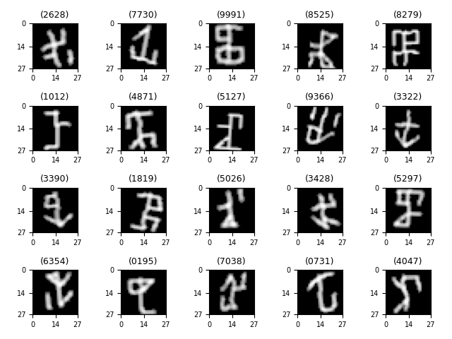

# MCIST: A Cistercian Numerals Dataset

For when you are sick and tired of MNIST Handwritten Digits... there's MCIST.
This script generates a Cistercian numerals dataset to be used as benchmark for machine learning methods and neural networks.
See [Wikipedia Cistercian numerals](https://en.wikipedia.org/wiki/Cistercian_numerals) for an explanation of Cistercian numerals.

## Example numerals:

## Usage:
Just run the script `mcist.py`. 
The script either loads the dataset from the pickle `mcist.pcl`, or creates this file, if it doesn't exist.
Parameters in the script are set to generate MNIST-like 28x28 glyphs, with integer pixel values normalized between 0 and 255.
Feel free to experiment with other parameter values (image sizes...), but just note that for honest comparisons between classifiers,
"the MCIST dataset" is understood as the dataset with the exact default parameters as found here.
The dataset is balanced. Each Cistercian numeral (0000...9999) appears 5 times in the training set and once in the test set.

## Please cite as:
If you use this dataset, please cite as:
 
> Mommen W., Keuninckx L. (2026). MCIST: A Cistercian Numerals Dataset (Version 1.0). 
> https://github.com/WoutMommen/MCIST. DOI https://doi.org/10.5281/zenodo.19135381.

or as shown in https://zenodo.org/records/19135381.

**Licenses:**
* **Data set: CC BY 4.0 license**
* **Code: MIT License**
